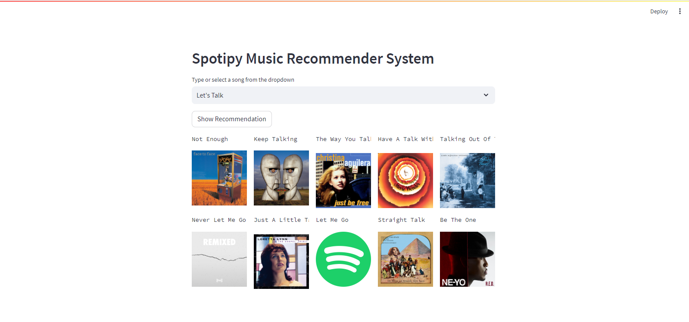

# 🎵 Spotify Music Recommendation System

A content-based music recommendation system that suggests similar songs based on your music preferences. Built with Python, Streamlit, and the Spotify Web API.

Deployed at https://spotify-music-recommendation.streamlit.app/



## ✨ Features

- **Personalized Recommendations**: Get song recommendations based on your music taste
- **Album Art Display**: Visualize recommended songs with their album covers
- **Spotify Integration**: Direct integration with Spotify's extensive music library
- **User-friendly Interface**: Simple and intuitive web interface built with Streamlit

## 🛠️ Prerequisites

- Python 3.8+
- Spotify Developer Account (for API credentials)
- pip (Python package manager)

## 🚀 Installation

1. Clone the repository:
   ```bash
   git clone https://github.com/SarthakB11/Spotify-Music-Recommendation-App.git
   cd Spotify-Music-Recommendation-App
   ```

2. Create and activate a virtual environment:
   ```bash
   python -m venv venv
   source venv/bin/activate  # On Windows use `venv\Scripts\activate`
   ```

3. Install the required packages:
   ```bash
   pip install -r src/requirements.txt
   ```

4. Set up Spotify API credentials:
   - Go to [Spotify Developer Dashboard](https://developer.spotify.com/dashboard/)
   - Create a new application
   - Copy your Client ID and Client Secret
   - Set them as environment variables:
     ```bash
     export CLIENT_ID='your-client-id'
     export CLIENT_SECRET='your-client-secret'
     ```

## 🎯 Usage

1. Run the Streamlit app:
   ```bash
   cd src
   streamlit run app.py
   ```

2. Open your browser and navigate to `http://localhost:8501`

3. Select a song from the dropdown menu

4. Click the "Show Recommendations" button to get similar songs

## 📦 Project Structure

```
├── README.md
├── demo.png
└── src/
    ├── app.py              # Main Streamlit application
    ├── Model Training.ipynb  # Jupyter notebook for model training
    ├── imp.pkl             # Preprocessed dataset
    ├── df.pkl              # Dataframe containing song information
    ├── similarity.pkl      # Precomputed similarity matrix
    └── requirements.txt    # Python dependencies
```

## 🤖 Technologies Used

- **Python**: Core programming language
- **Streamlit**: For building the web interface
- **Spotify Web API**: For fetching song data and album art
- **scikit-learn**: For machine learning and similarity calculations
- **pandas**: For data manipulation
- **NLTK**: For natural language processing tasks

## 📝 Dataset

The model is trained on the [Spotify Million Song Dataset](https://www.kaggle.com/datasets/notshrirang/spotify-million-song-dataset) from Kaggle.

## 📄 License

This project is licensed under the MIT License - see the [LICENSE](LICENSE) file for details.

## 🙏 Acknowledgments

- [Spotify](https://www.spotify.com/) for their amazing API
- [Kaggle](https://www.kaggle.com/) for hosting the dataset
- The open-source community for their valuable contributions
-> scikit-learn
